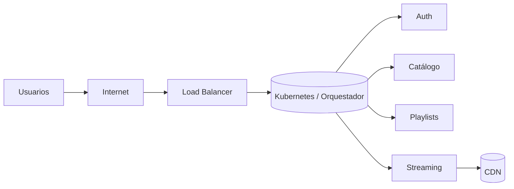

# Arquitectura

Describe la arquitectura objetivo y su evolución a lo largo del proyecto. Incluye contexto, componentes, integración y despliegue.

## Visión y contexto

- Objetivo del sistema: streaming de música tipo Spotify para mobile.
- Usuarios principales: oyentes, artistas, admins.
- Restricciones y supuestos: latencia baja para reproducción, disponibilidad alta, presupuesto acotado, NFRs clave (rendimiento, escalabilidad, observabilidad, seguridad).

## Diagrama de Contexto (C4 - Nivel 1)

Usa Mermaid para diagramas rápidos. Ejemplo de diagrama de contexto:

```mermaid
flowchart LR
  user[Usuario (Mobile)] -->|HTTP/HTTPS| api[API Gateway]
  api --> auth[Servicio de Autenticación]
  api --> catalogo[Servicio de Catálogo]
  api --> playback[Servicio de Reproducción]
  playback --> storage[Almacenamiento de Medios/CDN]
  catalogo --> db[(DB Catálogo)]
```

También podés subir imágenes a `assets/img/` y referenciarlas:


## Diagrama de Contenedores (C4 - Nivel 2)

```mermaid
flowchart TB
  subgraph Mobile
    app[App Melodia (Flutter/React Native)]
  end
  app --> gateway[API Gateway / BFF]

  subgraph Backend
    auth[Auth]
    users[Usuarios]
    catalogo[Catálogo]
    playlists[Playlists]
    streaming[Streaming]
    analytics[Analytics]
  end

  gateway --> auth
  gateway --> users
  gateway --> catalogo
  gateway --> playlists
  gateway --> streaming
  streaming --> cdn[CDN/Storage]
  catalogo --> db_catalogo[(DB Catálogo)]
  users --> db_users[(DB Usuarios)]
  playlists --> db_playlists[(DB Playlists)]
  analytics --> dq[Data Lake/Queue]
```

## Componentes y responsabilidades (C4 - Nivel 3)

- API Gateway / BFF: adaptación a mobile, agregación de endpoints, rate limiting, auth.
- Auth: login/registro, tokens, gestión de sesiones, providers externos.
- Catálogo: alta/baja/modificación de canciones, metadata, búsqueda.
- Playlists: gestión de playlists, favoritos, recomendaciones básicas.
- Streaming: entrega de medios, transcodificación previa, integración CDN.
- Analytics: eventos de reproducción, métricas de uso, reportes.

## Diagrama de Despliegue



## Integraciones externas

- Pasarela de pagos (si aplica).
- Proveedor de almacenamiento / CDN: S3, CloudFront, etc.
- Autenticación social: Google/Apple (si aplica).

## Decisiones destacadas (resumen)

- Por qué microservicios y no monolito en este contexto.
- Tecnología de frontend mobile (Flutter/React Native) y racional.
- Databases por servicio vs. compartida.
- Observabilidad: logs centralizados, métricas y trazas.

> Detalle completo en la sección Decisiones (ADRs).
