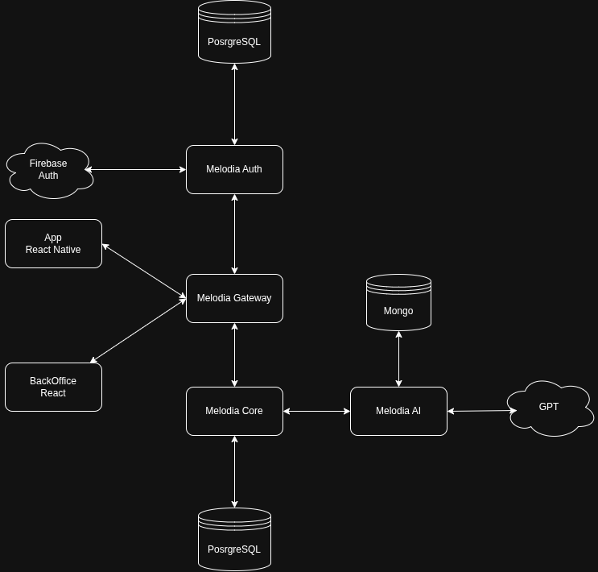

# Arquitectura

Describe la arquitectura objetivo y su evolución a lo largo del proyecto. 

## Servicios

La arquitectura general de nuestro sistema es la siguiente:

### Componentes del sistema **Melodia**:

- App: utiliza React Native sin Expo.
- Melodia Gateway: API Gateway de nuestro sistema. La aplicación se comunica únicamente con él, y las peticiones son redirigidas al servicio correspondiente. Está implementado en TypeScript con Express.
- Melodia Auth: se trata de un servicio de autenticación construido con Node.js, Express y TypeORM, que utiliza Postgres como motor de base de datos. Se encarga de manejar autenticación de usuarios, y utiliza Firebase Auth.
- Melodia Core: servicio principal del ecosistema Melodia, desarrollado con FastAPI y Postgres. Contiene la lógica de negocio principal de Melodia, y es dueño del catálogo de canciones y artistas. 
- Melodia AI: servicio encargado de gestionar las estadísticas y métricas de artistas, canciones y oyentes; integrando recomendaciones de IA con Groq. Utiliza FastAPI y MongoDB.

### Servicios Cloud utilizados:

- Nuestro proyecto se encuentra desplegado con [Dokploy](http://dokploy.cartonsito.com:3000/dashboard/project/OycyD3JTKofNvJFKQ8iux/environment/4j04AVV58kCiQHjB2JLR3)
- Para hostear las bases de datos relacionales y para el storage de Melodia se utiliza [Supabase](https://supabase.com/dashboard/org/amvxsgsseqjaopjhvomh)
- Para hostear la base de datos no relacional utilizamos [MongoDB Atlas](https://cloud.mongodb.com/v2/68e82af3edd80546e3df1fee#/overview)
- El coverage del backend se encuentra desplegado en [Codecov](https://app.codecov.io/gh/is2-tp-melodia)
- Los servicios de Melodia se monitorean mediante [Datadog](https://app.datadoghq.com/dash/integration/1/system---metrics?fromUser=false&refresh_mode=sliding&from_ts=1761853271958&to_ts=1761856871958&live=true)

## Decisiones

## Modelos de Datos

