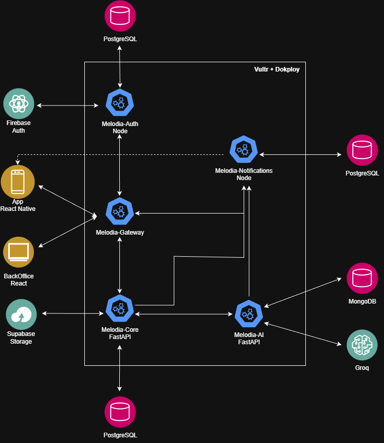

# Arquitectura

En esta página se describe la arquitectura utilizada y las decisiones tomadas. 

## Servicios

El ecosistema **Melodia** cuenta con la siguiente arquitectura:

### Componentes del sistema **Melodia**:

- **App**: aplicación mobile implementada con React Native sin Expo.
- **Melodia Gateway**: API Gateway de nuestro sistema. La aplicación se comunica únicamente con él, y las peticiones son redirigidas al servicio correspondiente. Está implementado en TypeScript con Express.
- **Melodia Auth**: se trata de un servicio de autenticación construido con Node.js, Express y TypeORM, que utiliza Postgres como motor de base de datos. Se encarga de manejar autenticación de usuarios, y utiliza Firebase Auth.
- **Melodia Core**: servicio principal del ecosistema Melodia, desarrollado con FastAPI y Postgres. Contiene la lógica de negocio principal de Melodia, y es dueño del catálogo de canciones y artistas. 
- **Melodia AI**: servicio encargado de gestionar las estadísticas y métricas de artistas, canciones y oyentes; integrando recomendaciones de IA con Groq. Utiliza FastAPI y MongoDB.
- **Melodia Notifications**: este servicio se encarga de administrar las notificaciones de nuestra aplicación. Implementado con Express en Typescript con Express y Postgres.

### Servicios Cloud utilizados:

- Nuestros servicios se encuentran desplegados utilizando Vultr y [Dokploy](http://dokploy.cartonsito.com:3000/dashboard/project/OycyD3JTKofNvJFKQ8iux/environment/4j04AVV58kCiQHjB2JLR3). Vultr actúa como nuestro proveedor de infraestructura en la nube, donde alojamos las máquinas virtuales que ejecutan nuestros servicios. Sobre esas instancias utilizamos Dokploy, una plataforma de despliegue auto-hosteada que facilita la administración de aplicaciones basadas en Docker. 
- Para hostear las bases de datos relacionales y para el storage de Melodia se utiliza [Supabase](https://supabase.com/dashboard/org/amvxsgsseqjaopjhvomh)
- Para hostear la base de datos no relacional utilizamos [MongoDB Atlas](https://cloud.mongodb.com/v2/68e82af3edd80546e3df1fee#/overview)
- El coverage del backend se encuentra desplegado en [Codecov](https://app.codecov.io/gh/is2-tp-melodia)
- Los servicios de Melodia se monitorean mediante [Datadog](https://app.datadoghq.com/dash/integration/1/system---metrics?fromUser=false&refresh_mode=sliding&from_ts=1761853271958&to_ts=1761856871958&live=true)

## Decisiones tomadas

Para la aplicación, decidimos utilizar React Native sin Expo porque ... COMPLETAR

En cuanto a FastApi, decidimos elegirlo como framework web para Melodia-Core y Melodia-AI ya que los tres integrantes que estuvimos trabajando en dichos backends contamos con mayor experiencia en Python y utilizamos ese mismo framework para el TP0. Además, nos pareció intuitivo utilizarlo para Melodia-AI ya que python es mas adecuado para la inteligencia artificial.

Con respecto a Node... COMPLETAR

Elegimos Postgres para las bases de datos relacionales ya que es la opción de motor de base de datos gratuita que más utilizamos ademas de ser una de las más populares. De la misma forma, elegimos MongoDB para la base de datos no relacional porque es la más utilizada.

Explicación de groq y del modelo ... COMPLETAR

Explicación de Firebase ... COMPLETAR

