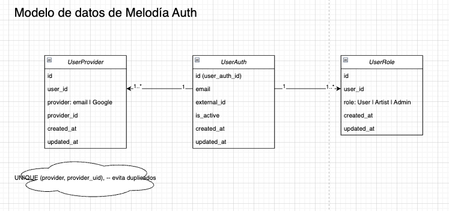
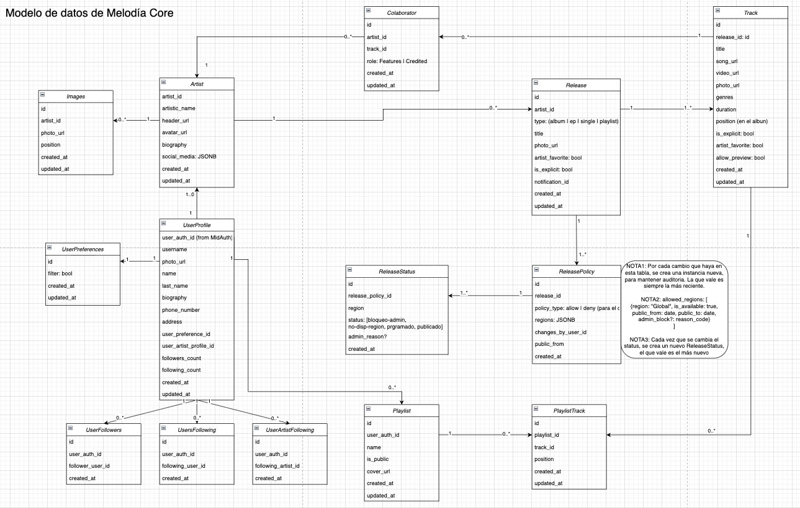
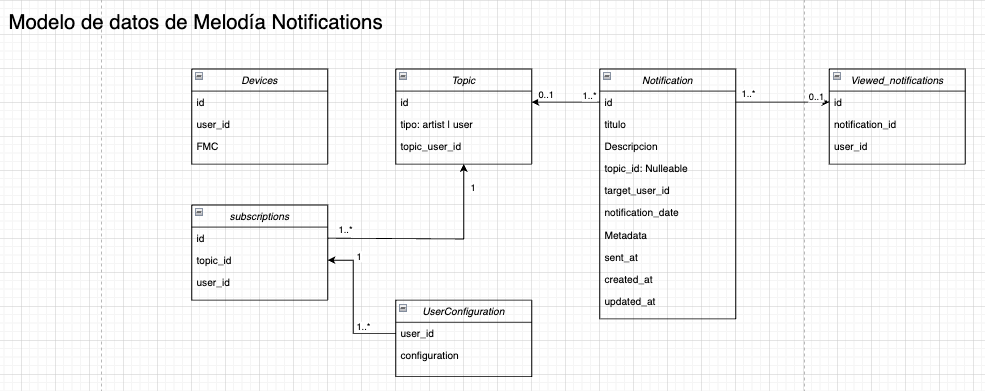
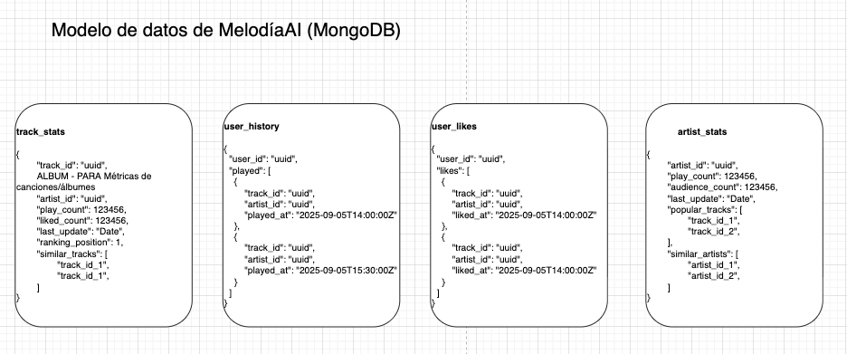

# Arquitectura

En esta página se describe la arquitectura utilizada y las decisiones tomadas.

## Servicios

El ecosistema **Melodia** cuenta con la siguiente arquitectura:

### Componentes del sistema **Melodia**:

- **App**: aplicación mobile implementada con React Native sin Expo.
- **Melodia Gateway**: API Gateway de nuestro sistema. La aplicación se comunica únicamente con él, y las peticiones son redirigidas al servicio correspondiente. Está implementado en TypeScript con Express.
- **Melodia Auth**: se trata de un servicio de autenticación construido con Node.js, Express y TypeORM, que utiliza Postgres como motor de base de datos. Se encarga de manejar autenticación de usuarios, y utiliza Firebase Auth.
- **Melodia Core**: servicio principal del ecosistema Melodia, desarrollado con FastAPI y Postgres. Contiene la lógica de negocio principal de Melodia, y es dueño del catálogo de canciones y artistas.
- **Melodia AI**: servicio encargado de gestionar las estadísticas y métricas de artistas, canciones y oyentes; integrando recomendaciones de IA con Groq. Utiliza FastAPI y MongoDB.
- **Melodia Notifications**: este servicio se encarga de administrar las notificaciones de nuestra aplicación. Implementado con Express en Typescript con Express y Postgres.

### Servicios Cloud utilizados:

- Nuestros servicios se encuentran desplegados utilizando Vultr y [Dokploy](http://dokploy.cartonsito.com:3000/dashboard/project/OycyD3JTKofNvJFKQ8iux/environment/4j04AVV58kCiQHjB2JLR3). Vultr actúa como nuestro proveedor de infraestructura en la nube, donde alojamos las máquinas virtuales que ejecutan nuestros servicios. Sobre esas instancias utilizamos Dokploy, una plataforma de despliegue auto-hosteada que facilita la administración de aplicaciones basadas en Docker.
- Para hostear las bases de datos relacionales y para el storage de Melodia se utiliza [Supabase](https://supabase.com/dashboard/org/amvxsgsseqjaopjhvomh)
- Para hostear la base de datos no relacional utilizamos [MongoDB Atlas](https://cloud.mongodb.com/v2/68e82af3edd80546e3df1fee#/overview)
- El coverage del backend se encuentra desplegado en [Codecov](https://app.codecov.io/gh/is2-tp-melodia)
- Los servicios de Melodia se monitorean mediante [Datadog](https://app.datadoghq.com/dash/integration/1/system---metrics?fromUser=false&refresh_mode=sliding&from_ts=1761853271958&to_ts=1761856871958&live=true)

## Decisiones tomadas

Para la aplicación, decidimos utilizar React Native sin Expo porque el equipo cuenta con mayor experiencia trabajando directamente sobre el entorno nativo, lo que nos permite tener un control más profundo sobre la configuración del proyecto, la integración con dependencias específicas y la personalización del comportamiento en Android. Además, optar por React Native bare nos evitó las limitaciones propias de Expo, como la dependencia del conjunto de módulos compatibles y las dificultades para integrar librerías nativas que no estén soportadas oficialmente. Esta elección nos brindó mayor flexibilidad, mejor integración con funcionalidades del sistema, la posibilidad de generar APKs independientes sin restricciones y un flujo de desarrollo más alineado con nuestras necesidades técnicas y experiencia previa.

En cuanto a FastApi, decidimos elegirlo como framework web para Melodia-Core y Melodia-AI ya que los tres integrantes que estuvimos trabajando en dichos backends contamos con mayor experiencia en Python y utilizamos ese mismo framework para el TP0. Además, nos pareció intuitivo utilizarlo para Melodia-AI ya que python es mas adecuado para la inteligencia artificial.

Con respecto a Node.js y Express, elegimos esta tecnología principalmente por la experiencia previa del equipo trabajando con entornos JavaScript y TypeScript, lo que nos permitió desarrollar el backend de manera más ágil y consistente con el stack utilizado en el frontend. Node ofrece un modelo asíncrono y altamente eficiente para manejar múltiples solicitudes concurrentes, lo cual es ideal para construir APIs livianas orientadas a aplicaciones móviles. Por su parte, Express aporta una estructura minimalista y flexible que facilita la creación de endpoints, el manejo de middleware y la integración con librerías externas. Además, el uso de TypeScript mejora significativamente la calidad del código al introducir tipado estático, autocompletado y detección temprana de errores, lo que resulta en un backend más robusto, mantenible y escalable. Esta combinación nos permitió desarrollar rápidamente, evitar errores comunes y asegurar una arquitectura clara y fácil de extender.

Para el proyecto utilizamos Groq como proveedor de modelos LLM debido a su baja latencia, alto rendimiento, compatibilidad nativa con el formato de la API de OpenAI, y por sobre todo, su free tier. Para el LLM utilizamos el modelo groq/compound, un modelo optimizado para tareas generales de conversación y razonamiento. Este modelo ofrece un balance adecuado entre velocidad, costo y calidad de respuesta, permitiendo manejar prompts complejos sin sacrificar rendimiento. Además, su compatibilidad con el estándar OpenAI simplifica tanto el desarrollo como el mantenimiento del servicio, ya que podemos intercambiar modelos sin cambios significativos en el código.

En cuanto al sistema de autenticación, optamos por utilizar Firebase Authentication porque ofrece una solución completa, segura y fácil de implementar, evitando la complejidad de construir un mecanismo propio de manejo de credenciales, hashing y recuperación de cuentas. Su integración nativa con aplicaciones móviles y su soporte para múltiples proveedores (email, Google, Apple, etc.) nos permitió implementar un flujo de login confiable y estándar en muy poco tiempo, aprovechando además la experiencia previa del equipo trabajando con servicios de Firebase. Esto redujo significativamente el riesgo de errores de seguridad y aceleró el desarrollo del backend.

Por otro lado, para el envío de notificaciones push seleccionamos Firebase Cloud Messaging, ya que proporciona un servicio robusto y gratuito para la entrega de mensajes en dispositivos Android, perfectamente integrado con React Native y sin necesidad de infraestructura adicional. FCM facilita la administración de tokens, el envío segmentado y la entrega confiable incluso con la aplicación en segundo plano. Sumado a nuestra familiaridad con el ecosistema de Firebase, esta elección simplificó la implementación, redujo la complejidad operativa y garantizó una solución escalable y eficiente para la comunicación con los usuarios.

Elegimos Postgres para las bases de datos relacionales ya que es la opción de motor de base de datos gratuita que más utilizamos ademas de ser una de las más populares. De la misma forma, elegimos MongoDB para la base de datos no relacional porque es la más utilizada.

En cuanto a los diagramas de las bases de datos podemos mostrar la siguiente documentación:

### Melodía Auth (PostgreSQL)

### Melodía Core (PostgreSQL)

### Melodía Notifications (PostgreSQL)

### Melodía AI (MongoDB)

