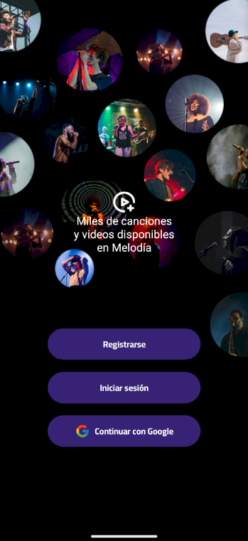
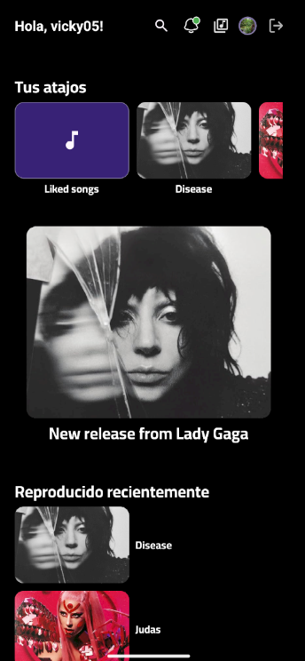
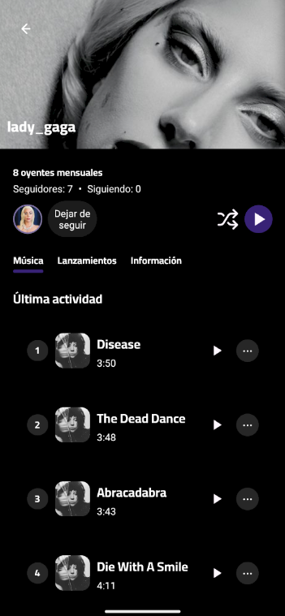
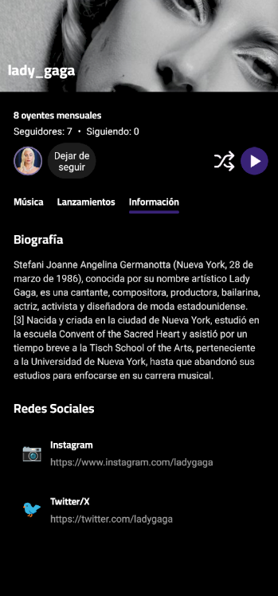
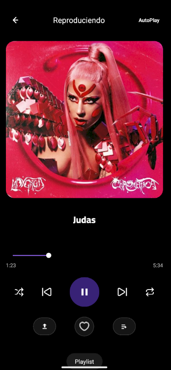
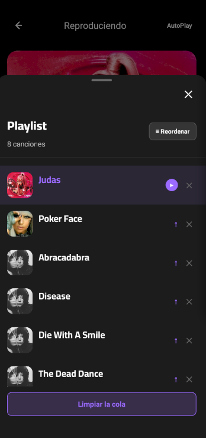
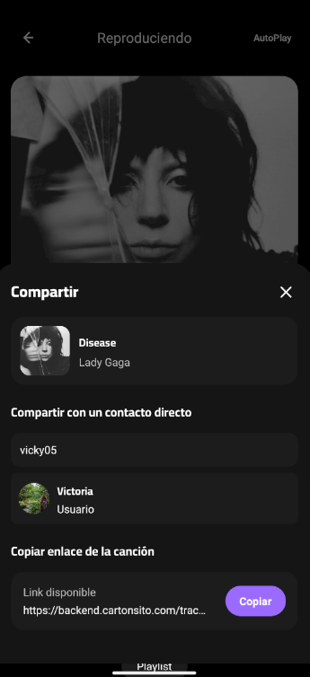
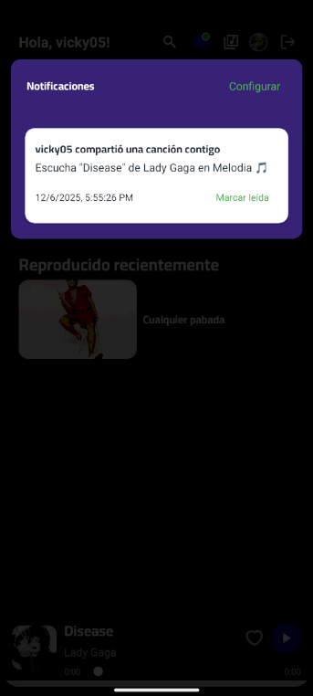

# Demos y showcases

Destaca features o implementaciones que quieran mostrar porque quedaron bien.

## Demo

- Aquí irá el video demo de la app. Sustituir el enlace/ID del iframe por el enlace real cuando esté disponible.

<iframe width="560" height="315" src="https://www.youtube.com/embed/VIDEO_ID" title="Demo Melodia" frameborder="0" allow="accelerometer; autoplay; clipboard-write; encrypted-media; gyroscope; picture-in-picture; web-share" allowfullscreen></iframe>

## Imágenes

	
	
	
	
	
	
	
	

