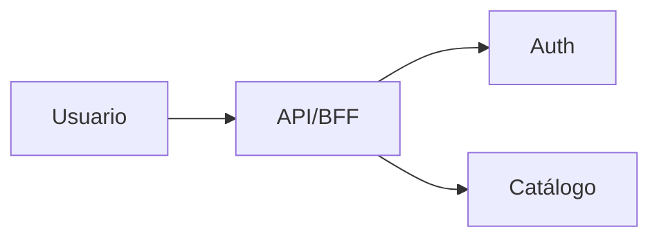

# Entrega 1 — Alcance y avances

## Objetivos del checkpoint

- Definir alcance, visión y stakeholders
- Primer diseño de arquitectura (C4 Nivel 1-2)
- Decisiones iniciales (ADRs propuesta)

## Arquitectura actual (snapshot)

- Diagrama de contexto y contenedores

## Decisiones tomadas en el período

- ADR-001: Microservicios vs Monolito — Estado: Propuesto
- ADR-002: Tecnología mobile — Estado: Propuesto

## Funcionalidades y demos

- Alcances implementados: <detalle>
- Demos: links a videos/capturas

## Problemas y riesgos

- Riesgo principal: <detalle>
- Mitigación: <detalle>

## Próximos pasos

- Historias priorizadas para E2
