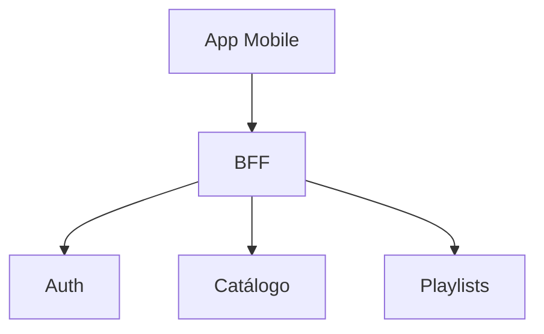

# Entrega 2 — Alcance y avances

## Objetivos del checkpoint

- Consolidar servicios principales y BFF
- Primeras pruebas de performance básicas

## Arquitectura actual (snapshot)

- Diagrama de contenedores actualizado

## Decisiones tomadas en el período

- ADR-003: CDN para audio — Estado: Propuesto/Aceptado
- ADR-004: BBDD por servicio — Estado: Propuesto/Aceptado

## Funcionalidades y demos

- Alcances implementados: <detalle>
- Demos: links a videos/capturas

## Problemas y riesgos

- <detalle>

## Métricas y observabilidad

- Tiempos de respuesta promedio
- Logs/trazas integradas

## Próximos pasos

- Preparación de E3: performance y estabilidad
