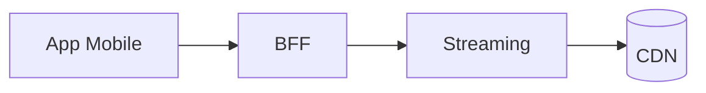

# Entrega 3 — Alcance y avances

## Objetivos del checkpoint

- Pulir features principales y UX
- Estabilizar performance y observabilidad

## Arquitectura actual (snapshot)

- Cambios respecto de E2

## Decisiones tomadas en el período

- <ADR nuevas>

## Funcionalidades y demos

- <detalle>

## Problemas y riesgos

- <detalle>

## Métricas y performance

- P95/P99 endpoints críticos
- MTTR de incidentes

## Próximos pasos

- Enfoque a E4 (cierre)
