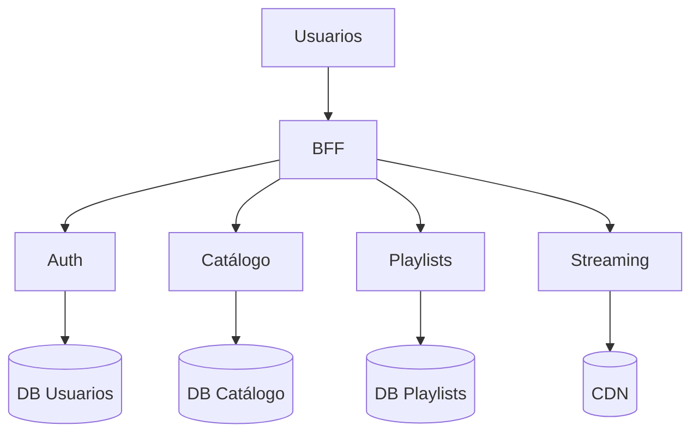

# Entrega 4 — Entrega final

## Objetivos del checkpoint

- Entrega final con foco en calidad y cierre de documentación

## Arquitectura final (snapshot)

- Diagrama final de despliegue y componentes

## Decisiones tomadas (resumen)

- Lista de ADRs aceptadas y su impacto

## Estado final y errores conocidos

- Ver sección "Estado, funcionalidades y errores"

## Lecciones aprendidas (cierre)

- Principales aprendizajes y recomendaciones

## Demos finales

- Video de walkthrough end-to-end

## Anexos

- Referencias, links a PRs, issues clave
