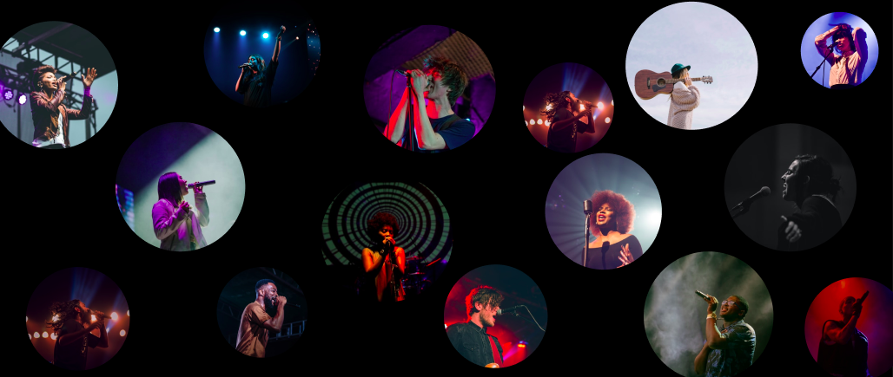

# Melodia — Bitácora del Proyecto

	

Este sitio sirve como bitácora viva y documentación del proyecto **Melodia**, una aplicación mobile tipo Spotify para la materia Ingeniería de Software II (TA049), FIUBA.

**Integrantes:**

| Nombre | Padrón |
|---|---|
| Victoria Avalos | 108434 |
| Tomás Lofano | 101721 |
| Tomás Caporaletti | 108598 |
| Facundo Gerez | 109429 |
| Camila Fernández Marchitelli | 102515 |

## Cómo navegar esta bitácora

- Arquitectura: tecnologías, diagramas y decisiones tomadas.
- Estado y errores: funcionalidades completas/incompletas, errores conocidos, deuda técnica.
- Lecciones aprendidas: problemas encontrados y aprendizajes.
- Demos: capturas, videos e historias de usuario destacadas.
- Entregas: documentación incremental por checkpoint (1 a 4).

## Checklist de avance por entregas

Consulta el detalle en la sección Entregas, pero aquí dejamos un resumen de avance estimado:

- [Entrega 1](entregas/cp1): ☐ Pendiente ☐ En curso ☑ Listo
- [Entrega 2](entregas/cp2): ☐ Pendiente ☐ En curso ☑ Listo
- [Entrega 3](entregas/cp3): ☐ Pendiente ☐ En curso ☑ Listo
- [Entrega 4](entregas/cp4): ☐ Pendiente ☑ En curso ☐ Listo

## Cómo contribuir a la documentación

- Mantener el contenido breve y accionable. Agregar referencias cuando aplique.
- Para cambios mayores (p.ej., nueva decisión de arquitectura), agregar/actualizar el ADR correspondiente en la sección Decisiones.
- Incluir diagramas con Mermaid (ver ejemplos en Arquitectura) o imágenes en `assets/img`.
- Repositorio del sitio: [is2-tp-melodia.github.io](https://github.com/is2-tp-melodia/is2-tp-melodia.github.io)

	
  

